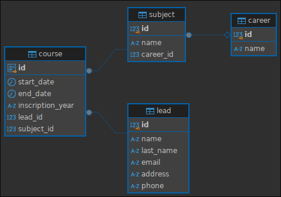

# Lead Challenge
This project is a REST API microservice developed in Python using FastAPI and Jinja2 to display a form on the frontend. The application allows enrolling Leads (people taking courses within a career) into a course. It also enables retrieving these courses paginated or by ID.

## Table of Contents
- [Technical Features](#technical-features)
- [Requirements](#requirements)
- [Installation](#installation)
- [Usage](#usage)
- [Testing](#testing)
- [Try App](#try-app)

## Technical Features
- **Backend**: FastAPI for lead management in a microservice.
- **Frontend**: Interface using Jinja2 for lead registration.
- **Testing**: Use of pytest for unit testing.
- **Database**: PostgreSQL for data persistence.
- **Infrastructure**: Use of Docker and Docker Compose.

### Database Design


### Project Structure
```
    /lead_challenge
        ├── app
        |   ├──dao
        |   ├──models
        |   ├──repository
        |   ├──routers
        |   |   ├── v1
        |   |   ├── api.py
        |   |   ├── dependencies.py
        |   ├──schemas
        |   ├──services
        |   ├──static
        |   ├──templates
        |   ├──utils
        |   ├──db.py
        |   ├──main.py
        ├── .gitignore
        ├── .env
        ├── docker-compose.yml
        ├── Dockerfile
        ├── init.sql
        ├── requirements.txt
        ├── VERSION
        └── README.md
```

### Design Patterns and Principles Used

1. **DAO (Data Access Object) Pattern:**
- Separation of data access logic and business logic.
- Each entity (Lead, Subject, Career, or Course) has its own DAO to handle specific database operations.
- This improves **modularity** and **maintainability** of the code, allowing changes in the persistence layer without affecting other parts of the system.

2. **DTO (Data Transfer Object) Pattern:**
- Use of DTOs to transfer data within the application.
- Facilitates **validation** and **transformation** of data before sending or receiving it from the API.

3. **Dependency Inversion Principle (DIP):**
- This principle is applied multiple times within the application. One example is in the database connection classes. The Repository objects depend on the abstract class `DatabaseManager` rather than concrete classes, which aligns with the **Open/Closed** principle.

4. **Open/Closed Principle:**
- Continuing with the example above, this principle allows extending the `DatabaseManager` class to handle multiple connections to different types of databases (PostgreSQL, MySQL, MongoDB, etc.) without modifying the code of the class itself.

5. **Single Responsibility Principle (SRP):**
- Each module (e.g., services, DAOs, controllers) has a single responsibility.
- This makes the code easier to **maintain** and understand.

6. **Repository Pattern (Alternative to DAO):**
- Used to centralize persistence logic in a single location.

7. **Containerization:**
- Use of Docker and Docker Compose to containerize the backend services and the database.
- Facilitates **deployment** and **scalability** of the system across different environments.

## Requirements
- **Docker** and **Docker Compose** installed on your system.

## Installation

1. **Clone the repository:**
```bash
    git clone https://github.com/Lautisuarez/lead_challenge.git
    cd lead_challenge
```

2. **Configure the environment file:**
Create a .env file in the root of the project with the following variables:
```
    POSTGRES_USER=admin
    POSTGRES_PSWD=admin
    POSTGRES_URL=db
    POSTGRES_PORT=5432
    POSTGRES_DB=leadDB
```

3. **Build and run the containers:**
Use docker compose to build and start the application containers:
```bash
    docker-compose up --build
```
This will start:
- A PostgreSQL container with the database.
- A container for the FastAPI backend along with the Jinja2 frontend.

## Usage
- Access the API documentation at: http://localhost:8000/docs.
- Access the lead registration form at: http://localhost:8000/.

## Testing
**Run unit tests:**
```bash
    pytest
```
Make sure you have a virtual environment set up and the required dependencies installed from the requirements.txt file.
There are two types of tests implemented:
1. Using a Mockup, which is currently implemented. Simply running the pytest command works.
2. Using the database from the compose (real database). The instructions for running this are documented in the test_course.py file.

## Try App
Try the app with the following links:
[Lead Challenge](https://lead-challenge.onrender.com/)
[Lead Challenge API](https://lead-challenge.onrender.com/docs)
